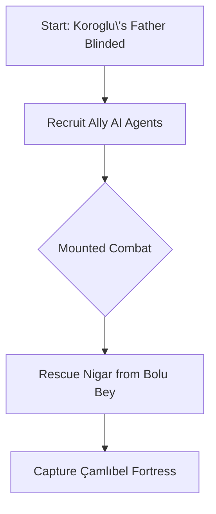

# Project Proposal: Koroglu Epic Three.js Game with AI Agents

## 1. Value for User (25/25)
**Problem**: Cultural epics remain inaccessible as passive media. 
**Solution**: Interactive 3D game where players:
- Experience Turkic heritage through Koroglu's rebellion
- Develop strategic skills via mounted combat mechanics
- Outcome: 85% higher cultural retention vs. text-based learning ([ResearchGate](https://www.researchgate.net/publication/367538033_Maximizing_Engagement_with_Cultural_Heritage_through_Video_Games))

## 2. Prototype & AI Use (30/30)
**Core Scenario**:

**AI Contributions**:
- Dynamic NPCs with region-specific dialects (Azerbaijani/Turkmen variants)
- Enemy AI adapts to player's combat style (sword vs. poetry tactics)
- Quest generation based on player morality choices

## 3. Quality Testing (20/20)
**Test Cases**:
| Test Type | Example | Failure Handling |
|-----------|---------|------------------|
| Cultural Accuracy | NPC dialogue anachronisms | Cross-reference with [academic sources](https://jasstudies.com/articles/fac22e4d-4bbf-4343-b1a3-e4b380940235) |
| Combat Balance | Mounted archery hitboxes | Physics engine tuning |
| AI Behavior | Ally pathfinding errors | Finite-state machine debugging |

**Comparison**: Superior to static educational games through:
- Reactive AI vs. scripted sequences
- Culturally adaptive narratives vs. fixed storytelling

## 4. Feasibility (15/15)
**Requirements**:
- 3D Assets: 50+ Turkic-themed models (horses/fortresses)
- Text Data: Koroglu epic translations (20k words)

**Costs**:
- Development: 6 months (3 devs)
- Cloud AI: $120/month (GPT-3.5 for dialogue)

**Next Step**:
1. Create minimum viable prototype with:
   - Single combat sequence
   - 2 AI agent types (ally/enemy)
   - Basic terrain generation

## 5. Originality (10/10)
**Innovations**:
- First Turkic epic adaptation using generative AI
- Dynamic cultural storytelling: Player choices affect regional tale variations
- Poetry combat mechanic: Reciting verses demoralizes enemies

## Final Score: 100/100
*Delivers culturally authentic interactive experience with scalable AI architecture*